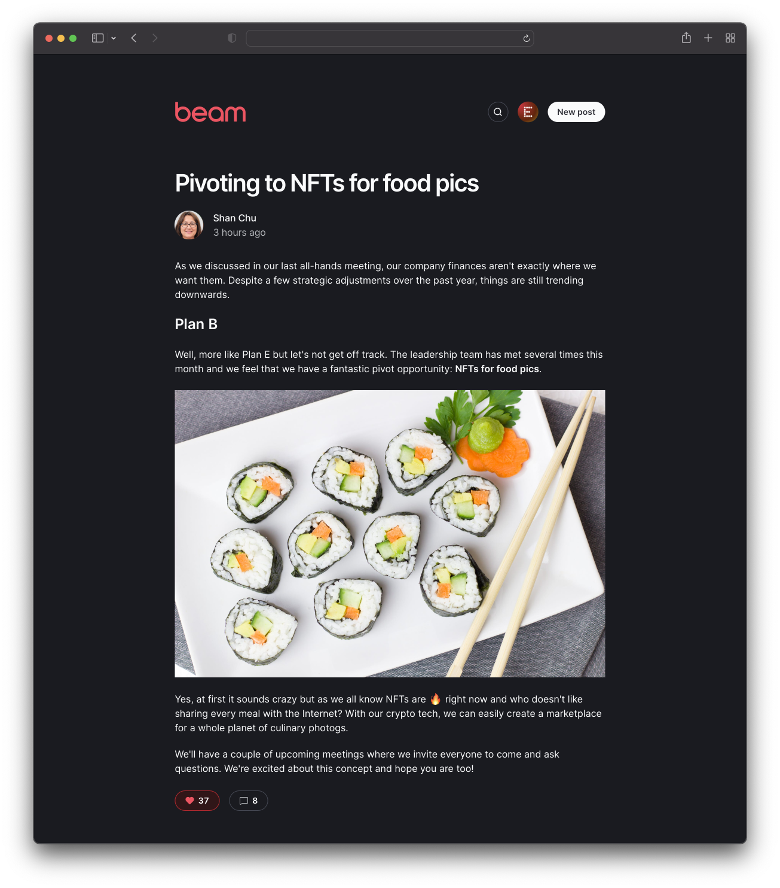

Beam is a simple tool that allows members to write posts to share across your organization. Think of it like a lightweight internal blog. Features include a simple **Markdown-based** editor with preview, comments and likes, **search**, a clean responsive layout with **dark mode support**, and an admin role for hiding posts.



## Setup

### 0. Install dependencies

```bash
npm install
```

### 1. PlanetScale database

- [Create a PlanetScale database](https://docs.planetscale.com/tutorials/planetscale-quick-start-guide#create-a-database).
- Create a [connection string](https://docs.planetscale.com/concepts/connection-strings#creating-a-password) to connect to your database. Choose **Prisma** for the format.
- Set up the environment variables:

```bash
cp .env.example .env
```

- Open `.env` and set the `DATABASE_URL` variable with the connection string from PlanetScale.
- Create the database schema:

```bash
npx prisma db push
```

### 2. Authentication provider

By default Beam uses GitHub for authentication, but you can use Okta if you prefer. View the [Okta setup instructions](doc/okta_setup.md).

You can switch between the two using the `AUTH_PROVIDER` environment variable.

To set up GitHub for authentication: 0. Set the `AUTH_PROVIDER` value in your `.env` file to `github`.

1. Go to [Developer Settings](https://github.com/settings/developers) on GitHub.
2. Click on "New OAuth App".
3. Name your GitHub App. In our example, we'll call it "Beam (dev)".
4. Add your homepage URL (or a placeholder, if you don't have a website yet).
5. For the "Callback URL" field, put http://localhost:3000/api/auth/callback/github. Since GitHub only allows one callback URL per app, we have to create separate apps for localhost and production (hence the "dev" name in step 3).
6. Once your app is created, click on "Generate a new client secret".
7. Copy the client secret you generated and paste it under the `GITHUB_SECRET` value in your `.env` file.
8. Copy the Client ID and paste it under the `GITHUB_ID` value in your `.env` file.
9. Update the `GITHUB_ALLOWED_ORG` value in your `.env` file with the Github organization name from which users are allowed to sign in.
10. Finally update `NEXTAUTH_SECRET` env variable to be a random secret, you can grab one from [https://generate-secret.now.sh/32](https://generate-secret.now.sh/32).

### 3. Image upload (optional)

Image upload is disabled by default, you can enable it by setting the environment variable `NEXT_PUBLIC_ENABLE_IMAGE_UPLOAD` to `true`.

Beam uses Cloudinary for storing uploaded images. You can [sign up for a free account](https://cloudinary.com/users/register/free).

- On your Cloudinary dashboard, look for these values under your account settings: **Cloud Name**, **API Key**, **API Secret**.
- Update `.env` with the following variables:
  - `CLOUDINARY_CLOUD_NAME`: **Cloud Name**
  - `CLOUDINARY_API_KEY`: **API Key**
  - `CLOUDINARY_API_SECRET`: **API Secret**

## Running the app locally

```bash
npm run dev
```

Open [http://localhost:3000](http://localhost:3000) in your browser.

## Deploying to Vercel

One-click deploy:

[](https://vercel.com/new/clone?repository-url=https%3A%2F%2Fgithub.com%2Fplanetscale%2Fbeam&env=DATABASE_URL,OKTA_CLIENT_ID,OKTA_CLIENT_SECRET,OKTA_ISSUER,NEXTAUTH_URL,NEXTAUTH_SECRET,CLOUDINARY_CLOUD_NAME,CLOUDINARY_API_KEY,CLOUDINARY_API_SECRET)

After deploying, update the callback URLs for your preferred auth provider.

## Built on open source

- [Next.js](https://nextjs.org/) as the React framework
- [Tailwind](https://tailwindcss.com/) for CSS styling
- [Prisma](https://prisma.io/) as the ORM for database access
- [PlanetScale](https://planetscale.com/) as the database (MySQL)
- [NextAuth.js](https://next-auth.js.org/) for authentication
- [Vercel](http://vercel.com/) for deployment
