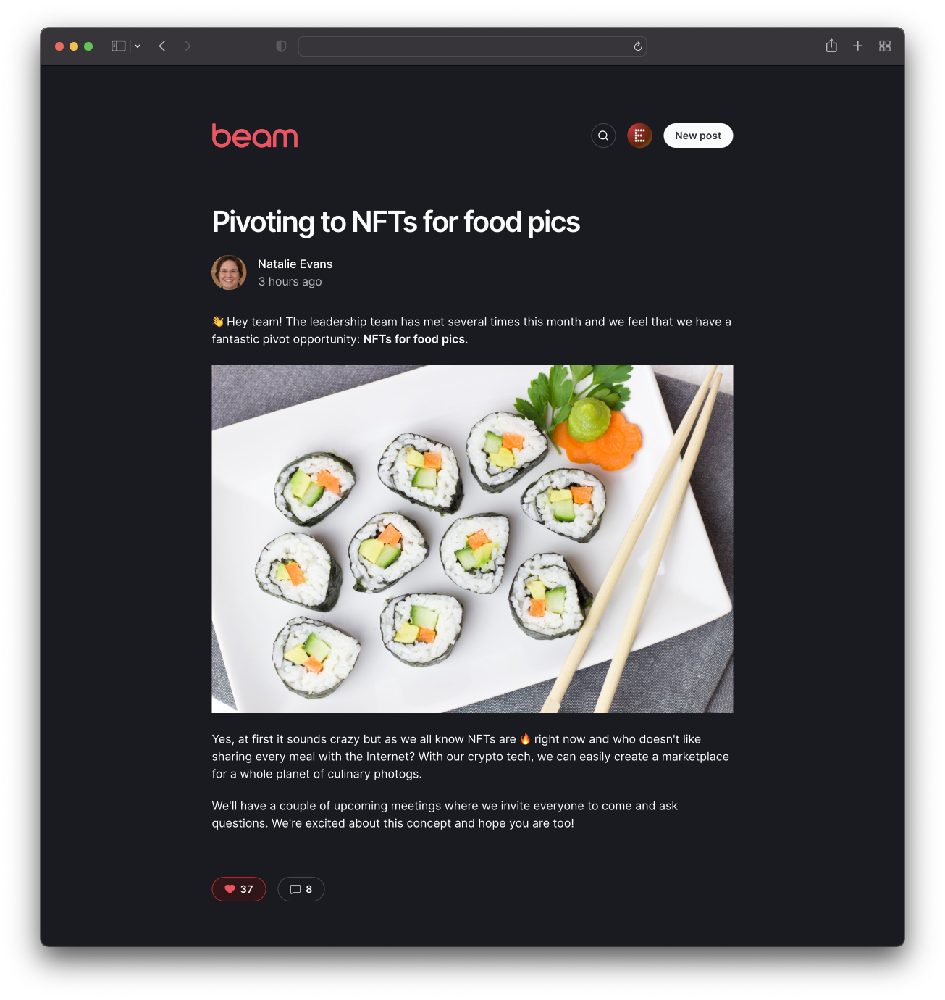

Beam is a simple tool that allows members to write posts to share across your organization. Think of it like a lightweight internal blog. Features include a simple **Markdown-based** editor with preview, comments and likes, **search**, a clean responsive layout with **dark mode support**, and an admin role for hiding posts.



## Setup

### Install dependencies

```bash
npm install
```

### Create a database

- [Create a PlanetScale database](https://docs.planetscale.com/tutorials/planetscale-quick-start-guide#create-a-database)
- Create a [connection string](https://docs.planetscale.com/concepts/connection-strings#creating-a-password) to connect to your database. Choose **Prisma** for the format
- Set up the environment variables:

```bash
cp .env.example .env
```

- Open `.env` and set the `DATABASE_URL` variable with the connection string from PlanetScale
- Create the database schema:

```bash
npx prisma db push
```

### Configure authentication

By default Beam uses GitHub for authentication, but [you can use Okta](doc/okta_setup.md) if you prefer.

- **Create an OAuth app on GitHub** (_Note that a separate app must be created for production use_)
  - Go to [Developer Settings](https://github.com/settings/developers)
  - Click on **New OAuth App**
  - For **Callback URL**, enter `http://localhost:3000/api/auth/callback/github`
  - Once the app is created, click **Generate a new client secret**
- **Set environment variables in `.env`**
  - Set `AUTH_PROVIDER` to `github`
  - Set `GITHUB_ID` to the Client ID value
  - Set `GITHUB_SECRET` to the secret value generated above
  - Set `GITHUB_ALLOWED_ORG` to the GitHub organization name your Beam members must belong to
  - Set `NEXTAUTH_SECRET` to a random secret. [This](https://generate-secret.now.sh/32) is a good resource.

### Enable image uploads (optional)

To enable image uploads, set the environment variable `NEXT_PUBLIC_ENABLE_IMAGE_UPLOAD` to `true`.

Beam uses Cloudinary for storing uploaded images. You can [sign up for a free account](https://cloudinary.com/users/register/free).

- On your Cloudinary dashboard, look for these values under your account settings: **Cloud Name**, **API Key**, **API Secret**.
- Update `.env` with the following variables:
  - `CLOUDINARY_CLOUD_NAME`: **Cloud Name**
  - `CLOUDINARY_API_KEY`: **API Key**
  - `CLOUDINARY_API_SECRET`: **API Secret**

## Running the app locally

```bash
npm run dev
```

Open [http://localhost:3000](http://localhost:3000) in your browser.

## Deploying to Vercel

One-click deploy:

[](https://vercel.com/new/clone?repository-url=https%3A%2F%2Fgithub.com%2Fplanetscale%2Fbeam)

⚠️ Remember to update your callback URLs after deploying.
